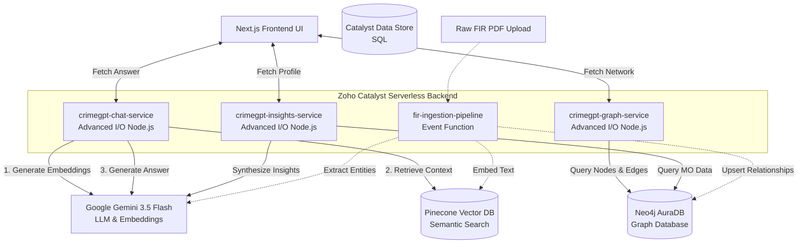

# 🚔 CrimeGPT: Next-Generation Law Enforcement Intelligence Platform


**CrimeGPT** is a comprehensive, AI-driven intelligence platform built for the **Karnataka State Police (KSP) Datathon**. It acts as a digital investigator, transforming raw, unstructured police data (FIRs, PDFs, case files) into actionable intelligence, visual criminal network graphs, and precise sociological profiles.

By combining **Generative AI (Google Gemini)** with **Graph Databases (Neo4j)** and **Vector Search (Pinecone)**, CrimeGPT uncovers hidden connections between isolated crimes, identifies repeat offenders, and drastically accelerates the investigation process.

---

## ✨ Core Features in Detail

### 1. 🗣️ Multilingual RAG-powered Investigation Agent
- **What it does**: Officers can chat with their entire FIR database in natural language (both English and Kannada).
- **How it works**: Uses **RAG (Retrieval-Augmented Generation)** to fetch exact paragraphs from historical FIRs before answering.
- **Example Query**: *"ಸೈಬರ್ ಅಪರಾಧಕ್ಕೆ ಸಂಬಂಧಿಸಿದ ಪ್ರಕರಣಗಳ ಬಗ್ಗೆ ಮಾಹಿತಿ ಕೊಡಿ."* (Give me information about cases related to cyber crime).
- **Zero Hallucination Policy**: The AI is hard-coded to *only* answer based on retrieved FIR context and must append official `[FIR_ID]` citations to its claims, making it fully court-admissible as a research tool.

### 2. 🕸️ Automated Criminal Network Visualization
- **What it does**: Generates a real-time, interactive graph showing connections between seemingly unrelated cases.
- **How it works**: As an FIR is uploaded, the AI automatically extracts semantic entities (Accused Names, Victims, Bank Account Numbers, Phone Numbers). If a fraudster uses the same bank account across five different FIRs, CrimeGPT automatically draws lines connecting all five cases to that one account.
- **Impact**: Instantly exposes organized crime syndicates and money laundering networks without manual data entry.

### 3. 🧠 Sociological Offender Profiling
- **What it does**: Analyzes the Modus Operandi (MO) of criminals to predict future behavior and assess risk.
- **How it works**: Analyzes the unstructured text describing *how* the crime was committed, extracting operational zones, preferred targets, and psychological markers. Generates a "Risk Score" and "Flight Risk" metric for suspects.

### 4. ⚡ Serverless Event-Driven Ingestion
- **What it does**: Removes manual data entry bottlenecks.
- **How it works**: Officers simply upload an FIR PDF. A Zoho Catalyst background event triggers, OCRs the document, extracts entities, embeds the text into Pinecone, and updates the Neo4j graph automatically.

---

## 🚀 How is CrimeGPT Different from Existing Systems?

| Feature | Legacy Police Systems (e.g., CCTNS) | CrimeGPT |
| :--- | :--- | :--- |
| **Search Mechanism** | Rigid Keyword Search (Exact Match) | **Semantic Search** (Understands intent and context) |
| **Data Silos** | Cases are isolated rows in a SQL database | **Interconnected Knowledge Graph** |
| **Insights** | Manual reading of hundreds of pages | **Instant AI summarization with citations** |
| **Language** | Primarily English data entry | **Native Kannada support** for local context |
| **Data Entry** | Manual form filling | **Automated AI Entity Extraction from PDFs** |

---

## 🏗️ System Architecture & Data Flow

CrimeGPT uses a highly decoupled microservices architecture orchestrated on **Zoho Catalyst**. 

### ASCII Architecture Diagram
```text
[ Police Officer UI (Next.js) ]
         |
         | (HTTP/REST)
         v
+---------------------------------------------------+
|               ZOHO CATALYST BACKEND               |
|                                                   |
|  [ Chat Service ]  [ Graph Service ]  [ Insights ]|
|    (Port 3001)       (Port 3002)      (Port 3003) |
+---------------------------------------------------+
         |                 |                 |
         v                 v                 v
+----------------+  +-------------+  +--------------+
| Google Gemini  |  |   Pinecone  |  | Neo4j AuraDB |
| (LLM & Embed)  |  | (Vector DB) |  |  (Graph DB)  |
+----------------+  +-------------+  +--------------+
```

### Flowchart (Mermaid)
*(Note: If viewing on GitHub, this will render as a visual flowchart)*


---

## ☁️ Zoho Catalyst Utilization

This platform is heavily optimized to run on **Zoho Catalyst**, taking advantage of its enterprise-grade serverless features:

1. **Advanced I/O Functions (Node.js)**: Our core API backend. We divided the monolithic backend into three distinct microservices (`chat`, `graph`, `insights`). This allows Zoho to independently scale the chat service (which might have high traffic) without impacting the graph visualization service.
2. **Event Functions (fir-ingestion-pipeline)**: Used for asynchronous background processing. When a new FIR is pushed to Catalyst, this function wakes up, processes the heavy AI extraction, and goes back to sleep—ensuring the UI never hangs.
3. **Catalyst Data Store**: Used as the primary relational system of record for storing immutable, structured metadata (like Officer Login data, precise Timestamps, and Case Master tables).
4. **Catalyst File Store**: Provides secure, encrypted cloud storage for the raw, sensitive FIR PDFs.

---

## 📊 The Data Model

The system is built to ingest standard **Karnataka Police FIR data**. For this implementation, we utilize highly realistic mock data structured to mirror official KSP records.

### What Data We Extract & Use:
- **Case Identifiers**: Crime Numbers, FIR Dates, Police Station Jurisdictions (e.g., *Koramangala PS, Cyber Crime PS*).
- **Extracted Nodes (Neo4j)**: 
  - `FIR` (The central hub of an incident)
  - `Person` (Tagged as Accused, Victim, or Witness)
  - `FinancialAccount` (Bank accounts, UPI IDs used in fraud)
- **Extracted Relationships (Neo4j Edges)**:
  - `(Person)-[:ACCUSED_IN]->(FIR)`
  - `(Person)-[:OWNS_ACCOUNT]->(FinancialAccount)`
  - `(FIR)-[:INVOLVES_TRANSACTION]->(FinancialAccount)`
- **Modus Operandi (Pinecone)**: The raw, unstructured summary paragraph of the crime is vector-embedded to allow semantic searching for matching crime patterns.

---

## 💻 Local Development Setup

To run the full stack locally for development and testing:

1. **Clone the repository**:
   ```bash
   git clone https://github.com/your-org/crimegpt.git
   cd crimegpt
   ```

2. **Set up Environment Variables**: 
   Create a `.env` in `catalyst-backend` and `.env.local` in `frontend` with your keys:
   ```env
   LLM_API_KEY="your-gemini-api-key"
   VECTOR_DB_API_KEY="your-pinecone-key"
   NEO4J_URI="neo4j+s://your-db.databases.neo4j.io"
   NEO4J_USERNAME="neo4j"
   NEO4J_PASSWORD="your-password"
   ```

3. **Start the Environment**:
   We have included a custom ESM launcher to run the microservices locally.
   ```bash
   # Terminal 1: Start Backend Microservices
   cd catalyst-backend
   npm install
   node start-local.mjs

   # Terminal 2: Start Frontend
   cd frontend
   npm install
   npm run dev
   ```

4. **Access the platform**: Open `http://localhost:3000` in your browser.
