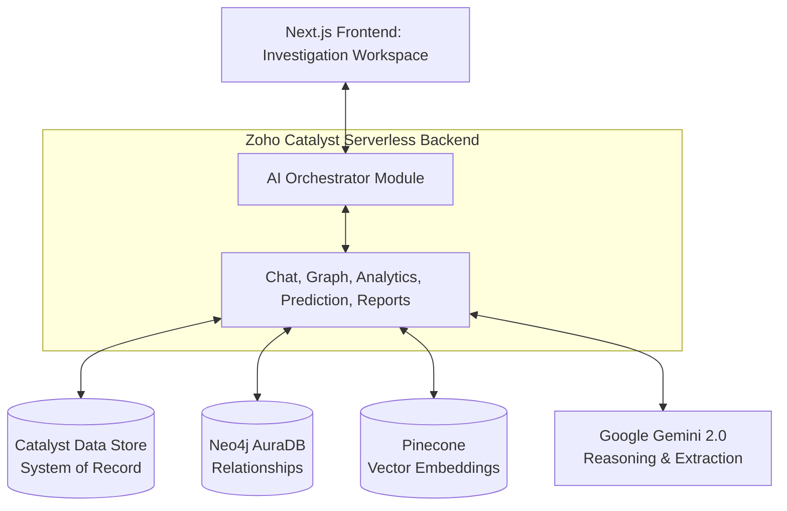

# 🚔 CrimeGPT: AI Investigation Copilot

**CrimeGPT** is a comprehensive, enterprise-grade AI Investigation Copilot built for the **Karnataka State Police (KSP) Datathon**. It acts as a digital investigator, transforming unstructured police data into actionable intelligence, visual criminal networks, and precise sociological profiles.

## ✨ MVP Philosophy

This implementation is designed as a high-impact MVP (Minimum Viable Product). We have prioritized a working end-to-end system that demonstrates cutting-edge AI capabilities. 
*Note: Authentication and RBAC have been bypassed for this demo, assuming deployment within a secure, trusted police intranet.*

## 🧠 Core Capabilities

1. **AI Orchestrator**: The central brain that routes queries, retrieves data from Zoho Catalyst and Neo4j, and enforces Explainable AI (XAI) principles.
2. **Investigation Workspace**: A unified dashboard for officers to view timelines, analyze criminal networks, and chat with evidence.
3. **Semantic Case Similarity**: Automatically finds related historical FIRs based on Modus Operandi (MO) and location using Pinecone vector search.
4. **Knowledge Graph Intelligence**: Uncovers hidden links between accused individuals, bank accounts, and phone numbers using Neo4j.
5. **Crime Forecasting**: Identifies emerging hotspots and predicts crime density using historical geospatial data.

## 🏗️ Catalyst-First Architecture

CrimeGPT is built on a simplified, modular architecture orchestrated by **Zoho Catalyst**:

## 🚀 Quick Start (Local Demo)

1. Clone and install dependencies in both `frontend` and `catalyst-backend`.
2. Configure `.env` with your API keys for Gemini, Pinecone, and Neo4j.
3. Run the Catalyst backend and Next.js frontend to access the unified Investigation Workspace at `http://localhost:3000`.
