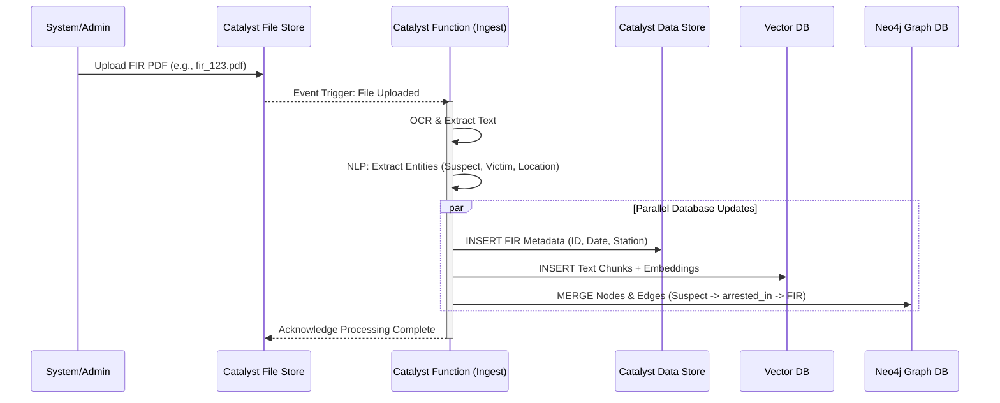
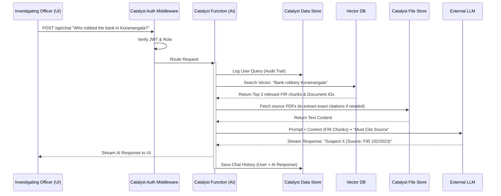
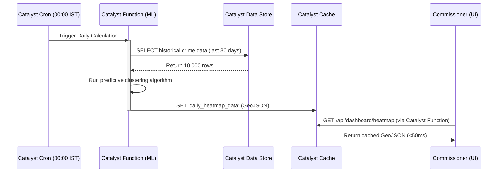

# Data Flow Architecture

## Overview
The **Data Flow** document illustrates how information moves through the **CrimeGPT** system, from data ingestion to user query and response. Understanding these pathways is crucial for ensuring data integrity, security, and performance within the **Zoho Catalyst-first** architecture.

---

## 1. Data Ingestion Flow

This flow describes what happens when a new FIR PDF is added to the system by an administrator or automated system.

**Key Catalyst Interaction:** The **Catalyst File Store** acts as the event source, automatically triggering the serverless **Catalyst Function** to handle the heavy lifting asynchronously.

---

## 2. Conversational AI Flow (CrimeGPT Query)

This flow illustrates a complex RAG (Retrieval-Augmented Generation) query initiated by an Investigating Officer.

**Key Catalyst Interaction:** **Catalyst Functions** orchestrate the entire flow, acting as the secure middleman ensuring the LLM only sees data it is allowed to see, and ensuring the audit log in the **Catalyst Data Store** is updated before the response is returned.

---

## 3. Analytics & Dashboard Data Flow

This flow illustrates how dashboards load quickly using cache, and how background jobs populate that cache.

**Key Catalyst Interaction:** **Catalyst Cache** ensures that complex, expensive database queries do not need to be run every time an officer logs in, ensuring a snappy UI experience and reducing database load.

---
**Next Steps:** Review the [Event Flow](./EventFlow.md) document to understand the asynchronous event-driven architecture within the system.
