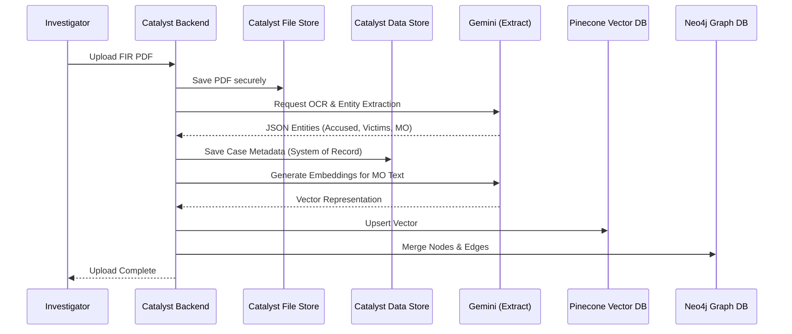
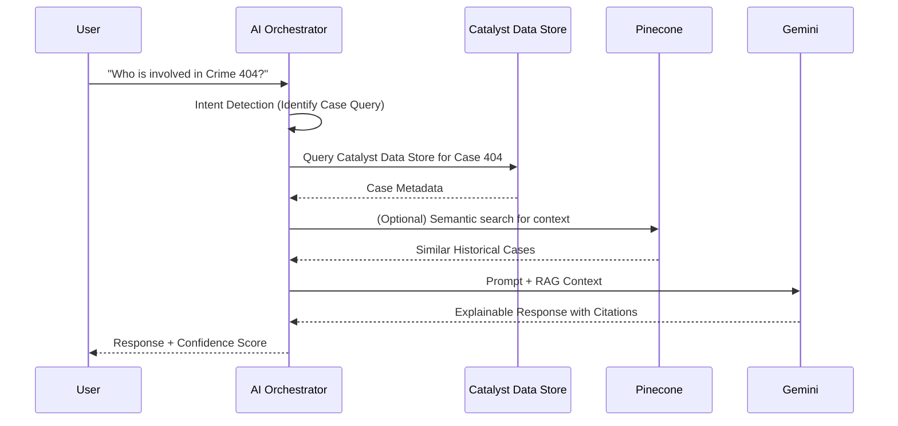
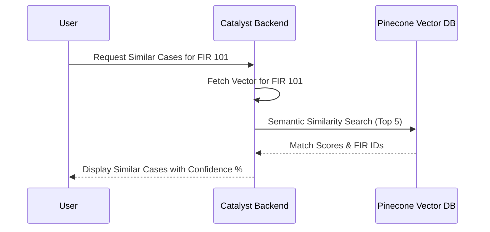

# Data Flow Documentation

## 1. Overview
This document illustrates how data moves through the CrimeGPT system across different operational flows.

## 2. Purpose
To provide absolute clarity on system integration points, ensuring developers understand exactly which service is responsible for which step of a workflow.

## 3. Functional Requirements
Not applicable (technical architecture document).

## 4. Technical Design (Data Flow Diagrams)

### FIR Upload Flow

### AI Chat Flow

### Case Similarity Flow

## 5. Edge Cases
- **Upload Failures**: If the Neo4j merge fails during an FIR upload, the system rolls back the Catalyst Data Store entry to prevent ghost records.

## 6. Future Enhancements
- Implement a Kafka message queue to handle extreme spikes in FIR uploads instead of synchronous Catalyst event functions.
