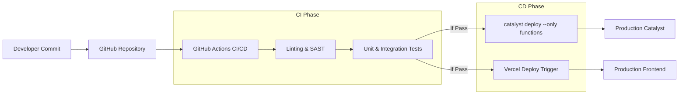

# Deployment Architecture

## Overview
The **Deployment Architecture** document outlines how the **CrimeGPT** codebase transitions from a developer's local machine into a secure, highly available production environment. By leveraging the **Zoho Catalyst** platform, traditional CI/CD pipelines and infrastructure provisioning are significantly simplified.

---

## 1. Production Environment

The production environment is entirely cloud-native and serverless.

### 1.1. Backend Deployment (Zoho Catalyst)
- **Environment:** Zoho Catalyst Production Environment (Region: IN - India Data Center to ensure data localization compliance).
- **Deployment Mechanism:** Catalyst CLI (`catalyst deploy`).
- **Components Deployed:**
  - Advanced I/O Functions (Node.js/Python).
  - Event Functions.
  - Cron Functions.
  - Client Application (if hosting the frontend via Catalyst Web Client Hosting).

### 1.2. Frontend Deployment (Vercel / Catalyst Web Hosting)
- **Primary Option (Vercel):** Ideal for Next.js applications, offering seamless SSR, edge caching, and automated Git deployments.
- **Secondary Option (Catalyst Web Client):** If strict project constraints mandate 100% Zoho hosting, the Next.js app can be exported as static HTML/JS (`next build && next export`) and hosted directly on Catalyst. *Tradeoff: Loses dynamic Server-Side Rendering (SSR) capabilities.*

### 1.3. External Services
- **Neo4j AuraDB:** Cloud-hosted managed graph database.
- **Vector DB (Pinecone/Weaviate):** Cloud-hosted managed vector search engine.
- **LLM API:** Accessed via secure HTTPS endpoints from Catalyst Functions.

## 2. CI/CD Pipeline

Continuous Integration and Continuous Deployment (CI/CD) ensures that code changes are tested and deployed reliably without manual intervention.

### 2.1. GitHub Actions Workflow
A `.github/workflows/deploy.yml` file manages the pipeline:
1. **Checkout Code:** Retrieves the latest `main` branch.
2. **Setup Dependencies:** Installs Node.js/Python and the Catalyst CLI.
3. **Testing:** Runs `npm test` and `pytest`.
4. **Authentication:** Authenticates with Catalyst using a headless CI token (`CATALYST_TOKEN` stored in GitHub Secrets).
5. **Deployment:** Executes `catalyst deploy` to push the latest function code to the Catalyst production environment.

## 3. Environment Management

Catalyst supports managing multiple environments to ensure untested code does not reach production.

- **Development Environment:** Used by developers locally (using `catalyst serve`) and deployed to a Catalyst 'Development' sandbox for integration testing. Uses dummy/anonymized data.
- **UAT / Staging Environment:** A mirror of production used for User Acceptance Testing by actual police officers. Connected to staging instances of the Graph and Vector DBs.
- **Production Environment:** The live system. Connected to the live KSP data feeds. Strict access controls apply; developers do not have direct access to the Production Catalyst Data Store.

## 4. Secrets Management

- **API Keys & Credentials:** External API keys (OpenAI, Neo4j, Vector DB) MUST NOT be hardcoded in the repository.
- **Catalyst Implementation:** Secrets must be stored using the **Catalyst Environmental Variables** feature. Catalyst Functions access these securely at runtime (e.g., `process.env.OPENAI_API_KEY`).

---
**Next Steps:** Review the [Scalability](./Scalability.md) document to understand how this deployed architecture handles spikes in traffic.
