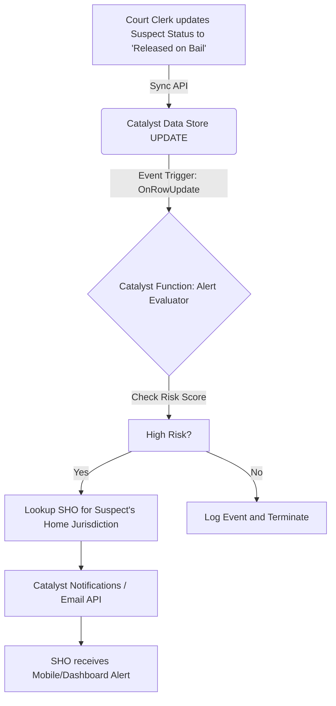
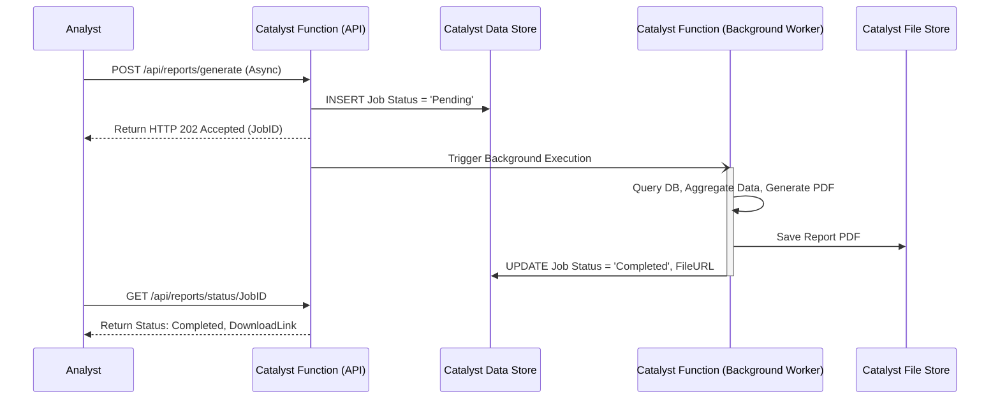

# Event Flow Architecture

## Overview
The **Event Flow Architecture** details the asynchronous, event-driven components of the **CrimeGPT** system. By decoupling heavy processing from synchronous API requests, the system remains highly responsive. This architecture relies heavily on **Zoho Catalyst's** event triggering and background task capabilities.

---

## 1. Event-Driven Philosophy

In a synchronous request-response model, the user waits for the server to finish processing before receiving a response. In an event-driven model, the server immediately acknowledges the request and processes the heavy lifting in the background.

**When to use Event-Driven Flows in CrimeGPT:**
- FIR PDF Upload and Ingestion.
- Generation of large PDF reports (e.g., Annual Crime Statistics).
- Sending automated notifications (e.g., Repeat Offender Alerts).
- Retraining machine learning models.

## 2. Event Triggers in Zoho Catalyst

Zoho Catalyst supports multiple trigger types that execute **Catalyst Functions** automatically.

| Event Source | Catalyst Trigger Type | Use Case in CrimeGPT |
| :--- | :--- | :--- |
| **Catalyst File Store** | File Upload Trigger | Triggering the OCR and NLP ingestion pipeline when a new FIR PDF is uploaded. |
| **Catalyst Data Store** | Data Modification Trigger (Webhooks/Change Data Capture) | Triggering an alert evaluation when a suspect's status changes to "Released on Bail". |
| **Catalyst Cron** | Time-based Scheduler | Triggering daily predictive heatmap generation at midnight. |

## 3. Core Event Flows

### 3.1. The "Suspect Released" Notification Flow
This flow ensures that when a habitual offender's status is updated in the database, the relevant Station House Officer (SHO) is immediately notified.

### 3.2. Asynchronous Report Generation
Generating a complex PDF report summarizing 5 years of crime statistics takes ~30 seconds, which would cause an HTTP timeout if run synchronously.

## 4. Error Handling and Dead Letter Queues (DLQ)

In asynchronous flows, if an event fails (e.g., the external LLM API is down during ingestion), the user is not actively waiting for an error message. Therefore, robust error handling is required.

- **Retry Logic:** Catalyst Functions handling events must implement exponential backoff for transient failures (e.g., network timeouts).
- **Dead Letter Logging:** If an event fails 3 times, the Catalyst Function must write a record to a `failed_events` table in the **Catalyst Data Store**.
- **Admin Alerts:** A separate Cron job will monitor the `failed_events` table and email the IT Administrator if the queue size exceeds a threshold.

---
**Next Steps:** Review the [Microservice Design](./MicroserviceDesign.md) document to see how these events map to specific service boundaries.
