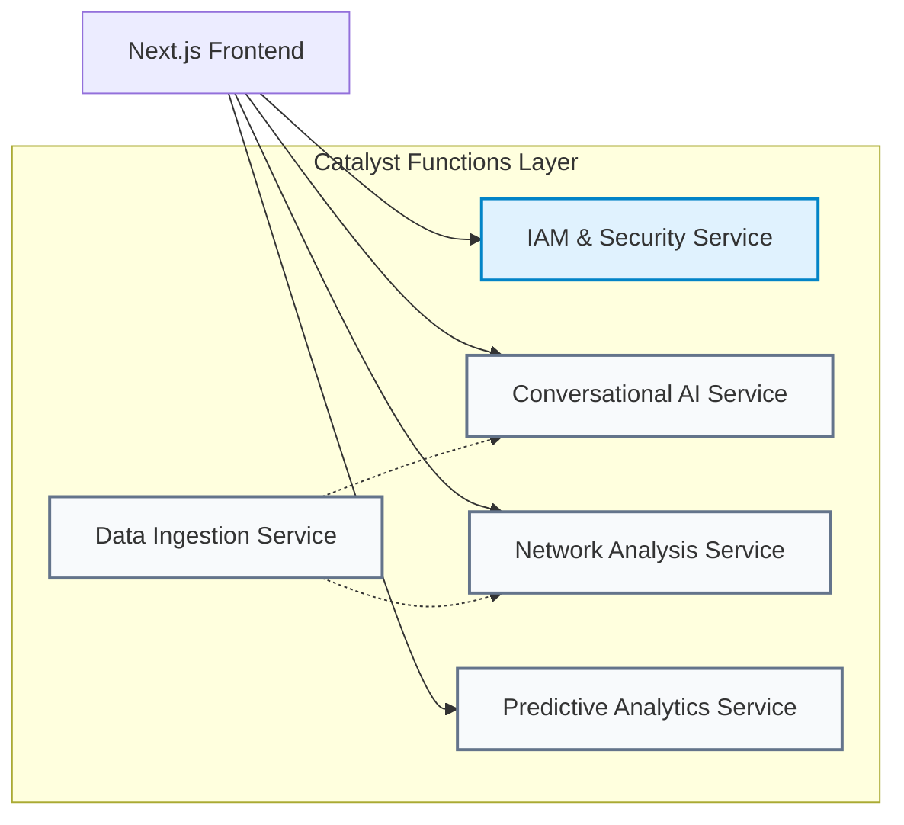

# Service Architecture

## Overview
The **Service Architecture** document breaks down the monolithic system architecture into logical, independent services (Microservices pattern implemented via **Catalyst Functions**). This decoupling ensures that the system is scalable, maintainable, and resilient to failure.

## 1. Service Boundaries
In a **Zoho Catalyst-first** architecture, we define "Services" as logical groupings of Catalyst Functions that share a specific domain responsibility.

---

## 2. Service Definitions

### 2.1. IAM & Security Service (Core)
**Responsibility:** Manages user identity, permissions, and audit logging.
**Catalyst Features Used:** Authentication, Data Store (Audit Logs), Functions.
**Endpoints:**
- `POST /api/auth/login` (Wraps Catalyst Auth login)
- `POST /api/auth/logout`
- `GET /api/users/me`
- `GET /api/admin/users` (RBAC protected)
**Dependencies:** None. This is the foundational service.

### 2.2. Data Ingestion Service
**Responsibility:** Processes incoming raw data (FIR PDFs, legacy database dumps) and normalizes it across the storage layer.
**Catalyst Features Used:** File Store (Triggers), Functions (Parsers).
**Endpoints/Triggers:**
- `EVENT FileStore.OnUpload`
- `POST /api/ingest/batch`
**Workflow:**
1. Triggers on PDF upload.
2. Extracts text (OCR).
3. Chunks text and calls Embedding API.
4. Stores vectors in Vector DB.
5. Extracts Named Entities and pushes to Neo4j.
6. Saves metadata to Catalyst Data Store.

### 2.3. Conversational AI Service (CrimeGPT)
**Responsibility:** Handles all natural language interactions, executing the RAG pipeline.
**Catalyst Features Used:** Functions, Cache (Chat Context), Data Store (Chat History).
**Endpoints:**
- `POST /api/chat/message` (Streaming endpoint)
- `GET /api/chat/sessions`
**Workflow:**
1. Receives query and chat session ID.
2. Identifies intent (using lightweight LLM call or regex).
3. Retrieves semantic chunks from Vector DB.
4. Fetches contextual PDFs from File Store.
5. Sends prompt + context to LLM.
6. Streams response back to UI while logging to Data Store.

### 2.4. Network Analysis Service
**Responsibility:** Serves the data required to render visual criminal network graphs on the frontend.
**Catalyst Features Used:** Functions.
**Endpoints:**
- `GET /api/network/suspect/:id`
- `GET /api/network/fir/:id`
**Workflow:**
1. Receives entity ID.
2. Executes Cypher query against Neo4j Graph DB.
3. Formats raw graph data into JSON suitable for frontend rendering (e.g., Vis.js format).

### 2.5. Predictive Analytics & Reporting Service
**Responsibility:** Generates crime forecasts and automated PDF briefings.
**Catalyst Features Used:** Cron, Cache, Functions, File Store.
**Endpoints/Triggers:**
- `CRON @daily 00:00`
- `GET /api/analytics/heatmap` (Served primarily from Cache)
- `POST /api/reports/generate-briefing`
**Workflow:**
1. Cron triggers Python ML script in Catalyst Functions.
2. Generates GeoJSON heatmap data.
3. Saves to Catalyst Cache.
4. If a user requests a briefing, a function generates a PDF, saves it to File Store, and returns a secure download link.

---

## 3. Inter-Service Communication
Because all services are deployed as **Catalyst Functions**, they communicate efficiently within the same secure environment. 
- **Synchronous:** When the Chat Service needs a specific network graph, it can internally invoke the Graph Service logic.
- **Asynchronous:** The Ingestion Service handles heavy processing asynchronously in the background, updating databases without blocking the UI.

---
**Next Steps:** Review the [Data Flow](./DataFlow.md) document to trace how specific pieces of information move through these services.
