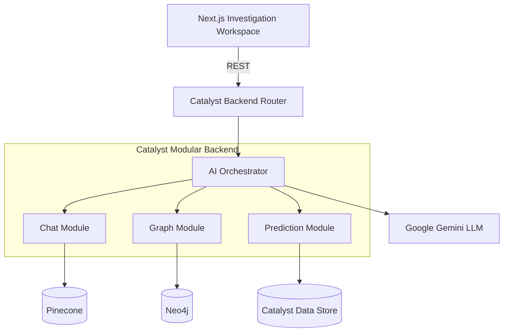

# System Architecture

## 1. Overview
The CrimeGPT architecture emphasizes a **Catalyst-First** modular approach. Instead of a complex, heavily fragmented microservices design, it utilizes a unified Zoho Catalyst backend to orchestrate all business logic, AI routing, and data retrieval.

## 2. Purpose
To provide a maintainable, high-performance, and hackathon-ready platform that showcases enterprise capabilities without unnecessary DevOps overhead (like dealing with multiple container deployments).

## 3. Technical Design

### The Catalyst-First Flow
1. **Next.js Frontend**: A single-page application serving the Investigation Workspace.
2. **Zoho Catalyst Backend**: A single logical backend application hosting modular functions (Chat, Graph, Analytics, Prediction, Report).
3. **Catalyst Data Store**: The absolute System of Record (SoR) containing FIRs, Cases, Officers, and Metadata.
4. **Neo4j**: Dedicated solely to querying complex relationships (e.g., finding shared bank accounts).
5. **Pinecone**: Dedicated solely to semantic similarity (e.g., comparing MO paragraphs).
6. **AI Orchestrator**: The central brain module inside Catalyst that intercepts user intent and triggers the right modules.

## 4. Data Flow

## 5. Edge Cases
- **Service Outage**: If Pinecone or Neo4j fails, the Catalyst Data Store provides fallback relational search capabilities.
- **High Concurrency**: Catalyst automatically scales the backend functions during high load events.

## 6. Future Enhancements
- Splitting the modules into true independent microservices once traffic necessitates isolated scaling.
- Implementing an API Gateway with strict rate-limiting.
