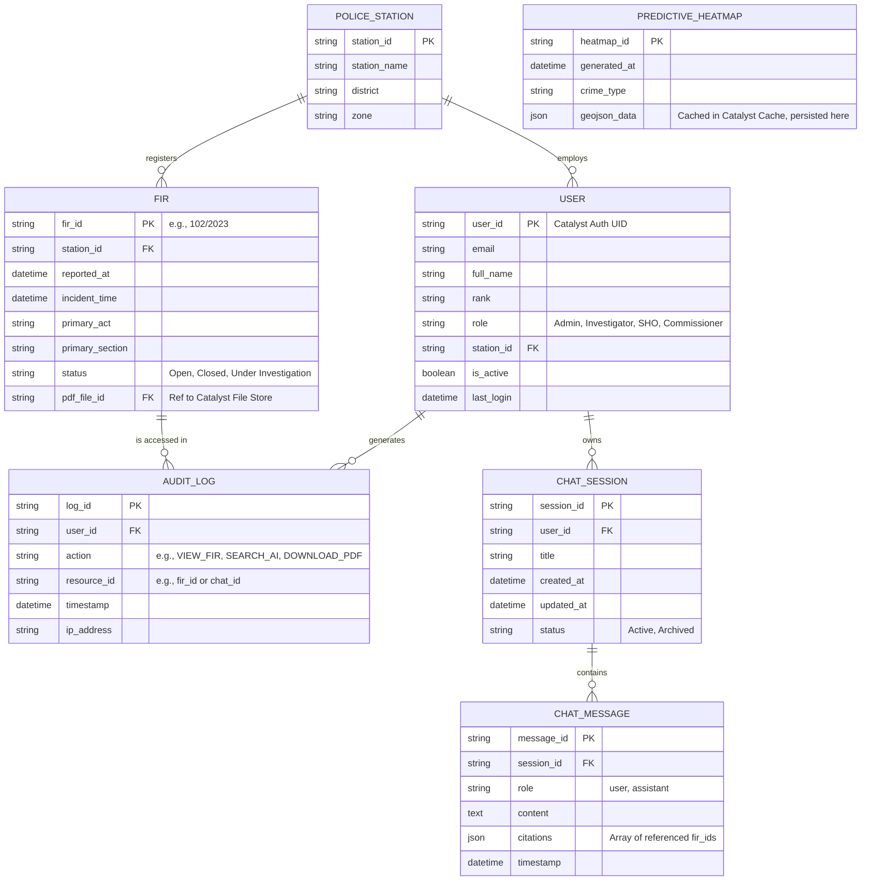

# Entity Relationship Diagram (ERD)

## Overview
The **Entity Relationship Diagram (ERD)** visualizes the logical structure of the relational database used in the **CrimeGPT** platform. This schema is specifically designed to be implemented within the **Zoho Catalyst Data Store**.

The ERD focuses on structured metadata, user management, audit logging, and chat session history. (Complex entity relationships like suspect networks are relegated to the Neo4j Graph Database, not the relational Data Store).

---

## 1. ERD Visualization

## 2. Design Rationale for Catalyst Data Store

### 2.1. Normalization vs. Performance
- The schema is primarily in Third Normal Form (3NF) to ensure data integrity.
- **Exception:** `citations` in the `CHAT_MESSAGE` table and `geojson_data` in the `PREDICTIVE_HEATMAP` table are stored as JSON strings. Catalyst Data Store supports JSON storage, which allows us to avoid overly complex many-to-many join tables for data that is typically read as a single block by the frontend.

### 2.2. Linking to Catalyst Authentication
- The `USER` table uses the unique `user_id` generated by **Catalyst Authentication** as its Primary Key. This ensures a 1:1 mapping between the identity provider and our application's metadata.

### 2.3. Linking to Catalyst File Store
- The `FIR` table does not store the PDF binary in the database. It stores `pdf_file_id`, which acts as a pointer to the specific object in the **Catalyst File Store**.

### 2.4. Immutability of Audit Logs
- The `AUDIT_LOG` table is designed to be append-only. Catalyst Functions must not expose any endpoints that perform `UPDATE` or `DELETE` operations on this table, satisfying strict law enforcement compliance requirements.

---
**Next Steps:** Review the [Relational Schema](./RelationalSchema.md) document for the exact column definitions and data types to be configured in the Catalyst console.
