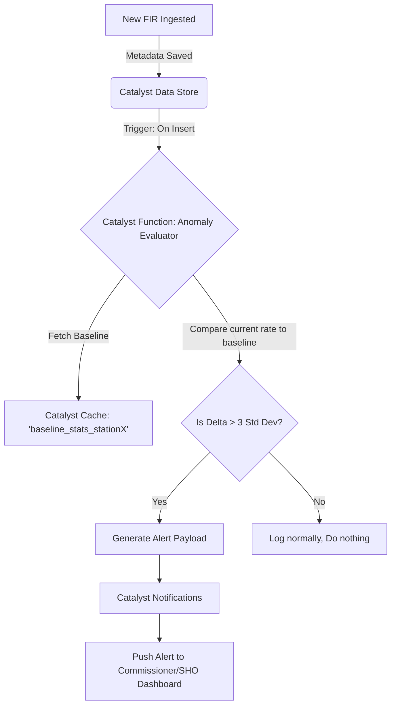

# Anomaly Detection

## Overview
The **Anomaly Detection** document outlines the mechanisms used by the **CrimeGPT** platform to automatically identify statistically significant deviations from normal crime patterns. While Prediction Models forecast the future, Anomaly Detection monitors the present in near real-time, alerting the KSP leadership to immediate crises.

---

## 1. What is an Anomaly?
In the context of law enforcement data, an anomaly is a sudden, unexpected spike in a specific type of crime within a specific geographic area that falls outside the standard deviation of historical norms.

**Examples:**
- 5 vehicle thefts reported in a single neighborhood within 2 hours (Normal rate: 1 per week).
- A sudden surge in FIRs registered under cyber fraud across multiple districts simultaneously.

## 2. Real-Time Processing Architecture

Anomaly detection requires near real-time analysis of incoming data. It cannot wait for a nightly batch job. It relies on the event-driven capabilities of **Zoho Catalyst**.

## 3. The Statistical Baseline (Catalyst Cache)

To determine if an event is anomalous, the system must know what "normal" looks like.
- Calculating the historical average every time a new FIR is inserted is far too slow and database-intensive.
- **Solution:** A **Catalyst Cron** job runs weekly to calculate the standard mean and standard deviation for every crime type, in every station jurisdiction, for every day of the week.
- This baseline matrix is stored in **Catalyst Cache**. The Anomaly Evaluator function simply fetches this cached matrix (< 10ms) and performs a basic mathematical comparison against the real-time data flow.

## 4. Alert Routing and Fatigue Mitigation

### 4.1. Alert Fatigue
If the system generates an alert every time two bicycles are stolen, officers will quickly ignore the system (Alert Fatigue).

### 4.2. Routing Logic
The **Catalyst Function** manages strict routing rules based on the severity of the anomaly:
- **Low Severity Anomaly (e.g., minor property crime spike):** Route to the local SHO's dashboard as a passive notification badge.
- **High Severity Anomaly (e.g., sudden spike in violent crimes or riots):** Trigger an immediate SMS/Email alert to the District DSP and State Commissioner via **Catalyst Notifications** API.

### 4.3. Feedback Mechanism
Officers must have the ability to dismiss an anomaly on their dashboard as a "Known Event" (e.g., a spike in minor thefts is expected during a massive local festival). This feedback is logged in the **Catalyst Data Store** to refine future alert thresholds.

---
**Next Steps:** Review the [Speech Pipeline](./SpeechPipeline.md) document to see how audio data is handled in the future roadmap.
