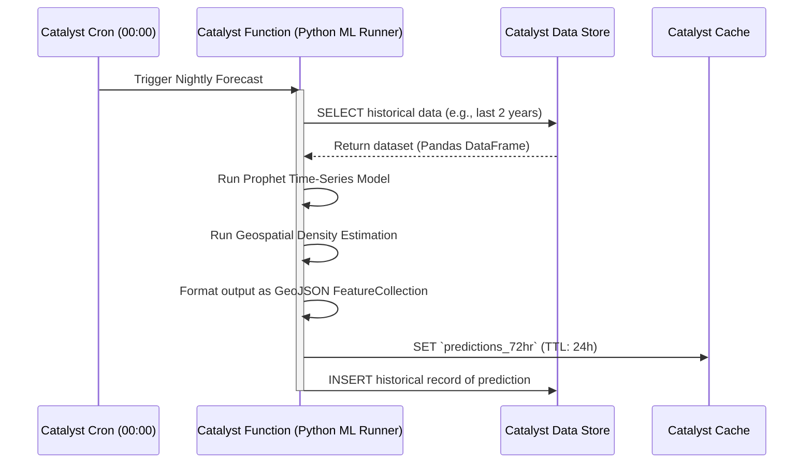

# Prediction Models

## Overview
The **Prediction Models** document details the Machine Learning (ML) architecture responsible for forecasting crime hotspots and trends. This capability transforms the **CrimeGPT** platform from an investigative tool into a proactive patrol management system for Station House Officers (SHOs).

---

## 1. Predictive Policing Philosophy
The goal is not to predict the exact time and place of a specific crime (which is impossible and prone to bias), but rather to identify geographical areas with a statistically elevated probability of specific crime types (e.g., property theft, vehicle theft) occurring within a 72-hour window.

## 2. Model Architecture

The prediction pipeline does not rely on Large Language Models (LLMs). It relies on classical statistical and ML models that excel at time-series and geospatial data.

### 2.1. Data Sources
The model is trained on structured data pulled from the **Catalyst Data Store**:
- Historical crime locations (Latitude/Longitude).
- Crime classifications (Act/Section).
- Temporal data (Time of day, Day of week, Month).
- *Future Context (if available):* Weather data, local festival calendars, socio-economic indicators.

### 2.2. The Algorithms
- **Geospatial Clustering (DBSCAN/K-Means):** Identifies historical clusters of crime to establish baseline hotspots.
- **Time-Series Forecasting (ARIMA / Facebook Prophet):** Analyzes the temporal frequency of crimes within those clusters to predict future spikes (e.g., recognizing that chain snatching in a specific cluster spikes every Friday evening).

## 3. Catalyst Execution Pipeline

Running these models requires significant compute power. The architecture leverages **Zoho Catalyst** background processing to ensure the UI remains fast.

### 3.1. Why Python in Catalyst?
The Catalyst Function responsible for this pipeline MUST be written in Python (Catalyst supports Node.js, Java, and Python). Python provides access to essential ML libraries like `pandas`, `scikit-learn`, and `prophet`, which are not easily available or performant in Node.js.

## 4. Output: The Predictive Heatmap
The primary output of this model is a standard GeoJSON object. 
- When an SHO logs into the dashboard, the Next.js frontend fetches this GeoJSON directly from the **Catalyst Cache**.
- A mapping library (e.g., Mapbox GL JS) renders the GeoJSON as a visual heatmap, with color intensity representing the probability score generated by the ML model.

## 5. Model Retraining and Drift
Crime patterns evolve. A model trained on 2021 data will be inaccurate in 2024.
- **Continuous Learning:** A separate **Catalyst Cron** job runs weekly to retrain the ML model weights using the newly added FIR data from the previous week, ensuring the model automatically adapts to shifting criminal behaviors (Concept Drift).

---
**Next Steps:** Review the [Anomaly Detection](./AnomalyDetection.md) document to see how the system identifies unusual spikes in real-time.
