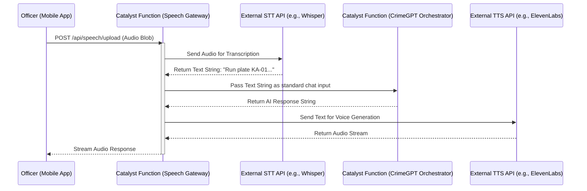

# Speech Pipeline (Future Roadmap)

## Overview
The **Speech Pipeline** document outlines the architecture for integrating Voice-to-Text and Text-to-Voice capabilities into **CrimeGPT**. While out of scope for the Minimum Viable Enterprise Product (MVEP), designing the hooks for this pipeline early ensures a smooth integration path for future field operations.

---

## 1. The Use Case for Speech in Law Enforcement
Officers in the field (e.g., Highway Patrol, responding to an active crime scene) cannot easily type complex queries into a mobile device. They require a hands-free, radio-style interaction model:
*Officer:* "CrimeGPT, run this plate: KA-01-AB-1234."
*CrimeGPT (Voice):* "That vehicle is reported stolen in connection with a burglary in Indiranagar. Proceed with caution."

## 2. Speech Architecture (Catalyst Integration)

Handling speech requires specialized models (like Whisper for Speech-to-Text). These models are too heavy to run natively inside a standard serverless function; they must be called via external API.

## 3. Multilingual Support (Kannada)
The most significant hurdle in the Karnataka State Police context is the regional language. Standard global STT models often struggle with Indian dialects or English-Kannada code-switching (e.g., "Avanu swift car alli escape aada").
- **Solution:** The STT API selected must be explicitly fine-tuned for regional Indian languages (e.g., Bhashini API or specialized Google Cloud Speech-to-Text models for Kannada).

## 4. Security Considerations for Audio
- Audio blobs containing sensitive case information must be securely deleted from the **Catalyst Cache** immediately after processing.
- The external STT/TTS providers must be bound by Zero Data Retention (ZDR) agreements.

---
**Next Steps:** Review the [Translation Pipeline](./TranslationPipeline.md) document to see how text-based regional language translation is handled in the current scope.
