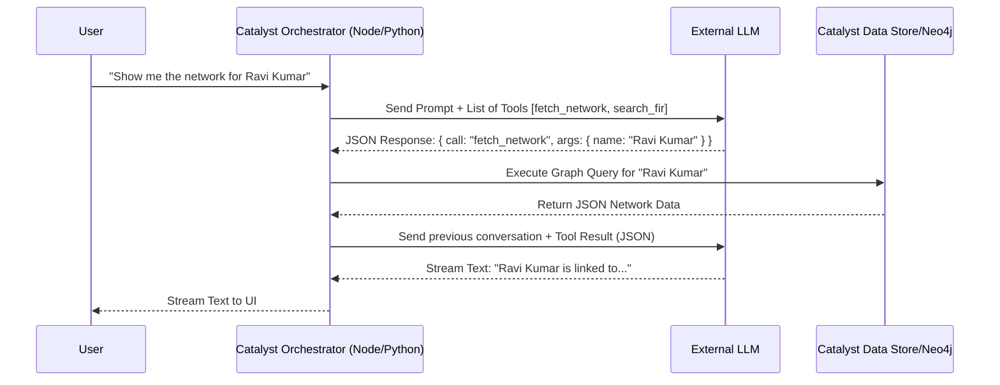

# LLM Tool Calling (Function Calling)

## Overview
The **Tool Calling** document details how the external Large Language Model (LLM) interacts dynamically with the **Zoho Catalyst** backend. Instead of the LLM just reading static text, Tool Calling allows the AI to "decide" to execute specific **Catalyst Functions** to fetch real-time data or perform calculations before returning an answer to the user.

---

## 1. What is Tool Calling?
Modern LLMs (GPT-4o, Gemini 1.5 Pro) support "Function Calling" (or Tools). You provide the LLM with a list of available tools (APIs) and their descriptions. The LLM analyzes the user's prompt and, instead of generating a text answer, outputs a structured JSON request asking the backend to run a specific tool on its behalf.

## 2. Tool Calling Flow in Catalyst

## 3. Registered Tools for CrimeGPT

The following tools will be registered with the LLM via the **Catalyst AI Orchestrator**.

### 3.1. `search_fir_database`
- **Description:** "Use this tool to search the text of historical FIRs for specific names, Modus Operandi (M.O.), or crime descriptions."
- **Arguments:** `query` (string), `station_id_filter` (string, optional).
- **Backend Action:** Triggers the Hybrid Search pipeline against the Vector DB and Catalyst Search.

### 3.2. `fetch_criminal_network`
- **Description:** "Use this tool when the user asks about the relationships, associates, or connections of a specific suspect."
- **Arguments:** `suspect_name` (string).
- **Backend Action:** Executes a Cypher query against Neo4j to fetch 2nd-degree connections.

### 3.3. `get_daily_heatmap`
- **Description:** "Use this tool when the user asks for crime predictions, hotspots, or where crimes are likely to happen."
- **Arguments:** `crime_type` (string).
- **Backend Action:** Fetches the pre-calculated GeoJSON data from **Catalyst Cache**.

## 4. Security Enforcement

The LLM is inherently untrustworthy; it cannot be allowed to execute database queries directly.
- **The Sandbox:** The LLM only returns a JSON *request* to use a tool. The **Catalyst Function** is the entity that actually executes the database query.
- **RBAC Validation:** Before executing the tool requested by the LLM, the Catalyst Function MUST verify that the currently logged-in user has the permission to run that tool. (e.g., If the LLM requests `delete_fir`, the function will reject the request and throw a 403 Forbidden error back to the LLM).

---
**Next Steps:** Review the [Explainable AI](./ExplainableAI.md) document to understand how we prove the LLM's answers are correct.
