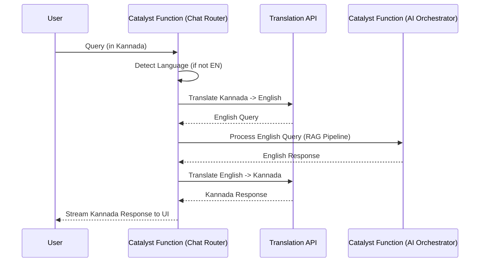

# Translation Pipeline

## Overview
The **Translation Pipeline** is a critical component of the **CrimeGPT** platform. The Karnataka State Police operates primarily in Kannada, especially at the local station level, while advanced AI processing (LLMs, Vector Embeddings) performs best in English. This document outlines how **Zoho Catalyst Functions** mediate this language barrier.

---

## 1. The Language Barrier Challenge

1. **Ingestion:** Historical FIRs are largely handwritten or typed in Kannada.
2. **Embeddings:** High-quality embedding models (like OpenAI `text-embedding-3`) are predominantly trained on English text. Creating semantic vectors from Kannada text yields poorer similarity matches.
3. **User Query:** An officer might ask a question in Kannada, but the underlying data (if translated during ingestion) is in English.

## 2. Ingestion Translation Flow (Standardization)

To ensure high-accuracy semantic search, all unstructured text must be standardized to a common processing language (English) before it enters the Vector Database, while preserving the original Kannada text in the **Catalyst File Store** for legal authenticity.

1. **Upload:** Kannada FIR PDF is uploaded.
2. **OCR:** A specialized regional OCR extracts the Kannada text.
3. **Translation Catalyst Function:** The text is sent to an Enterprise Translation API (e.g., Google Cloud Translation Advanced, which supports custom glossaries).
4. **Glossary Enforcement:** A KSP-specific glossary ensures legal terms are translated accurately (e.g., ensuring specific IPC sections aren't literally translated into nonsensical phrases).
5. **Storage:** The *English* translation is chunked, vectorized, and stored in the Vector DB. The *Original Kannada* text is saved as metadata in the **Catalyst Data Store**.

## 3. Real-Time Query Translation Flow

When a user interacts with CrimeGPT in Kannada, the system must seamlessly translate back and forth.

## 4. Latency Mitigation
Calling an external translation API twice per chat message adds significant latency.
- **Optimization:** If the LLM provider natively supports highly accurate Kannada output (e.g., Gemini 1.5 Pro has strong multilingual capabilities), the final translation step can be skipped by simply prompting the LLM: *"Answer the following English query based on the English context, but output your final response in formal Kannada."* This reduces API hops and speeds up the TTFB (Time To First Byte).

---
**Next Steps:** Review the [Conversation Memory](./ConversationMemory.md) document to understand how the chat state is maintained across these translations.
