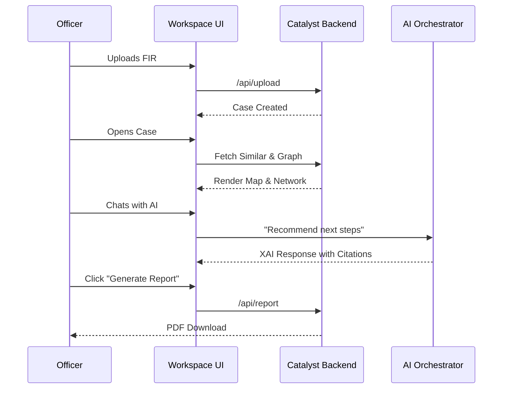

# End-to-End Investigation Workflow

## 1. Overview
This document describes the complete lifecycle of a case investigation within CrimeGPT, from the initial upload of an FIR to the generation of a final PDF report.

## 2. Purpose
To provide a holistic view of how the various modules (AI Orchestrator, Graph, Similarity, etc.) chain together to form a seamless user experience for the investigating officer.

## 3. Functional Requirements
The system must support a linear, intuitive progression that mimics an investigator's natural workflow, enhanced by AI at every step.

## 4. Technical Design

### The Lifecycle Steps
1. **FIR Upload**: Officer uploads a scanned PDF of a new FIR.
2. **OCR & Entity Extraction**: Catalyst triggers Gemini to extract suspects, victims, bank accounts, and the MO.
3. **Metadata Storage**: Structured data is saved to the Catalyst Data Store.
4. **Embedding Generation**: The MO is vectorized by Gemini.
5. **Vector Storage**: Upserted into Pinecone.
6. **Relationship Update**: Neo4j merges the new entities, linking the new FIR to existing nodes.
7. **Investigation Workspace**: The officer opens the new case in the UI.
8. **AI Orchestrator Processing**: The officer asks "Who else uses this bank account?"
9. **Criminal Network Analysis**: The Graph Module displays a visual web of all FIRs linked to that account.
10. **Case Similarity Search**: Pinecone retrieves 3 past cases with the exact same MO.
11. **Timeline Generation**: The system builds a chronological view of events from the extracted text.
12. **Crime Map Visualization**: Mapbox plots the locations of similar cases to identify the gang's operating zone.
13. **Investigation Recommendations**: The AI Orchestrator suggests interviewing a specific co-accused based on the graph.
14. **Explainable AI Response**: All AI suggestions include citations back to the specific FIRs.
15. **Report Generation**: The officer clicks "Export," generating a PDF summary of the findings.

## 5. Data Flow (Investigation Flow)

## 6. Edge Cases
- **Simultaneous Uploads**: Catalyst handles concurrent uploads via background queues to prevent race conditions during Neo4j entity merging.

## 7. Future Enhancements
- Integration with external CCTNS databases to pull historical records automatically without requiring manual PDF uploads.
