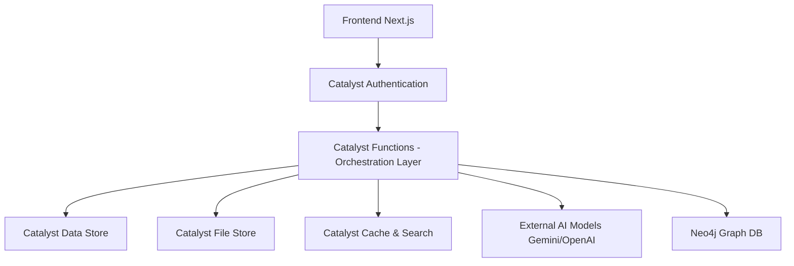

# CrimeGPT – AI-Powered Crime Intelligence & Investigation Platform

> **Karnataka State Police (KSP) - Enterprise Documentation Repository**

## Overview

**CrimeGPT** is an enterprise-grade, conversational intelligence platform built for the Karnataka State Police. It empowers investigators, analysts, and policymakers to interact with crime records using natural language. The system provides advanced crime analytics, criminal network analysis, predictive intelligence, and explainable AI to support investigation decision-making.

This project is architected with a strict **Zoho Catalyst-first philosophy**, utilizing Catalyst as the central orchestration layer, Backend-as-a-Service (BaaS), and primary data management system.

## Repository Structure

This repository contains the complete technical and product documentation for the CrimeGPT platform. It is structured to guide a development team from initial planning through production deployment.

| Directory | Description |
|-----------|-------------|
| **[00-Project](./00-Project/)** | Vision, Problem Statement, Objectives, Project Scope, Stakeholders, Glossary, Success Metrics, and Roadmap. |
| **[01-Product](./01-Product/)** | PRD, User Personas, User Stories, Epics, Functional/Non-Functional Requirements, Acceptance Criteria, Business Rules, Constraints, and Risks. |
| **[02-SystemDesign](./02-SystemDesign/)** | TRD, System Architecture, Service Architecture, Data Flow, Event Flow, Microservices, Component Design, Deployment, Scalability, and DR. |
| **[03-Database](./03-Database/)** | ERD, Relational Schema, Neo4j Graph Model, Vector Database, Caching strategies, Database Indexes, Migration, and Backup. |
| **[04-AI](./04-AI/)** | AI Architecture, Conversational AI, Knowledge Graph, RAG, Prompt Engineering, LLM Workflow, Hybrid Search, Semantic Search, Tool Calling, and XAI. |
| **[05-Features](./05-Features/)** | CrimeGPT Workspace, Case Management, Criminal Network, Analytics, Heatmaps, Forecasting, Sociological Insights, Offender Profiling, Decision Support. |
| **[06-Frontend](./06-Frontend/)** | Frontend Architecture, Design System, Theme Guide, Component Library, State Management, and Routing. |
| **[07-Backend](./07-Backend/)** | Catalyst-first Backend Architecture, API Architecture, Authentication, Authorization, Catalyst Integrations, Logging, and Monitoring. |
| **[08-Security](./08-Security/)** | Threat Model, RBAC, Encryption, Audit Trail, Data Privacy, Compliance, Incident Response, and Secure Coding standards. |
| **[09-API](./09-API/)** | REST API, OpenAPI, Endpoints, Error Handling, Validation, Pagination, and Streaming APIs. |
| **[10-Implementation](./10-Implementation/)** | Development Plan, Sprint Planning, Milestones, Coding Standards, Git Strategy, CI/CD, and Deployment Guide. |
| **[11-Testing](./11-Testing/)** | Unit Testing, Integration Testing, E2E Testing, Performance Testing, Security Testing, and AI Validation. |
| **[12-Diagrams](./12-Diagrams/)** | Centralized Mermaid diagrams for ER, Architecture, Sequence, Flow, Use Case, Activity, Component, and Deployment. |
| **[13-Appendix](./13-Appendix/)** | References, Future Scope, Known Limitations, License, and Contributors. |

## Catalyst-First Architecture Philosophy

The entire platform follows a strict Catalyst-first architecture. **Zoho Catalyst** is not just an integration; it is the core Backend-as-a-Service (BaaS) that powers the application.

Before utilizing any external service, the architecture dictates that a Zoho Catalyst equivalent must be evaluated and utilized if suitable.

## Getting Started

New developers should begin by reviewing the documents in the following order:
1. **[Vision & Objectives](./00-Project/Vision.md)** to understand the "Why".
2. **[PRD](./01-Product/PRD.md)** to understand the "What".
3. **[System Architecture](./02-SystemDesign/SystemArchitecture.md)** and **[Backend Architecture](./07-Backend/BackendArchitecture.md)** to understand the "How".
4. **[Implementation Guide](./10-Implementation/DevelopmentPlan.md)** to understand the "When".

---
*Generated for the Karnataka State Police DataHack / Innovation initiative.*
